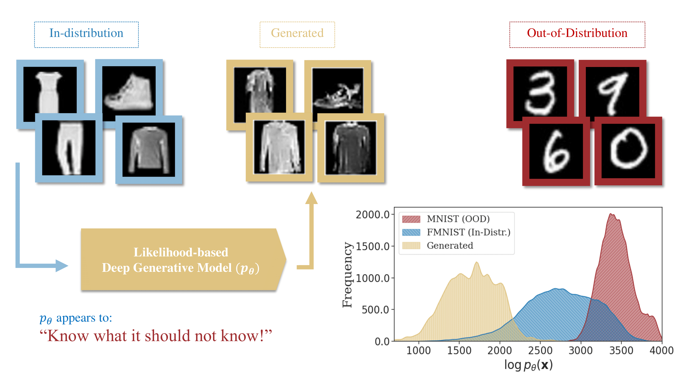
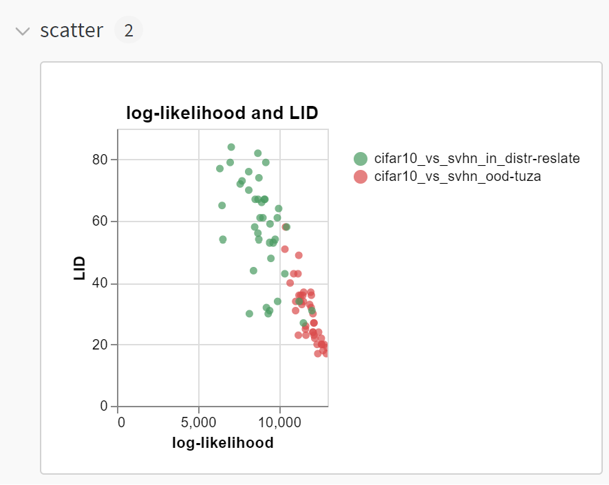
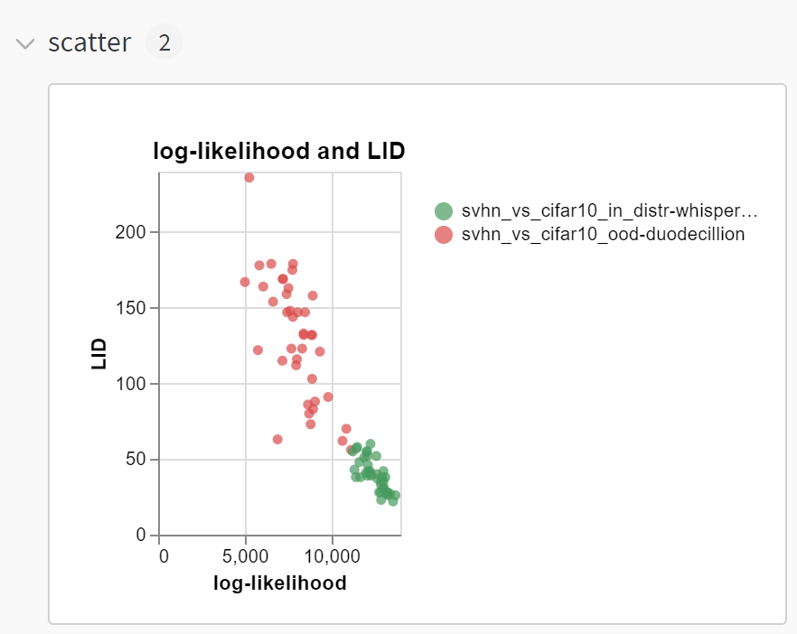

# OOD Detection with Likelihood-based Deep Generative Models

<p align="center">
  
</p>

# Overview

In many likelihood-based generative models, the model specifies a density function over all the possible datapoints, and the training process typically aims to increase the density for training (in-distribution) data. We know that densities integrate to one over all the possible datapoints, and as a consequence, one can reasonably assume that this would also decrease the density regions that are far apart from the training data, i.e., out-of-distribution (OOD) regions. Paradoxically, based on research first presented in Nalisnick et al.'s work titled ["Do deep generative models know what they don't know?"](https://arxiv.org/abs/1810.09136), likelihood values (or probability densities) alone are not a reliable indicator for whether a datapoint is OOD or not, and in many cases, the OOD data *consistently* gets higher likelihoods assigned (see the figure above).

On the flip side, the generative models that exhibit such pathological behavior are simultaneously capable of generating high-quality in-distribution data. Thus, the information required for OOD detection likely exists within these models, it just might not be the likelihood values alone. One important observation is that since OOD data is never generated from a generative model, the area around them (i.e., local probability mass around the OOD region) should have densities that integrate to a small probability. Thus using local probability *masses* instead of using mere probability *densities* seems like a more reasonable approach for OOD detection using generative models. To unravel this, we explore methods that take the entire high-dimensional density landscape induced by the generative model into consideration for OOD detection. 

This repository contains our ideas to tackle this problem alongside implementation of some recent relevant OOD detection baselines on a large set of models and datasets. The methods that are included are:

1. Likelihood ratio method for normalizing flows by [Ren et al.](https://arxiv.org/abs/1906.02845)
2. Complexity method for flow models by [Serrà et al.](https://arxiv.org/abs/1909.11480)
3. Likelihood ratio method for diffusion models by [Goodier et al.](https://arxiv.org/pdf/2310.17432.pdf) 
4. Reconstruction-based OOD detection with diffusions by [Graham et al.](https://arxiv.org/pdf/2211.07740.pdf)
5. Likelihood OOD detection based on LID estimates for diffusions and normalizing flows by [Kamkari et al.](TODO)


## Setup

### Environment

**The codebase uses functional autodiff features that were recently added to `pytorch`. Make sure that your Python is `3.9` or higher; otherwise, some of the new autodiff functionalities we use might break. You should also install the `nflows` package from [here](https://github.com/HamidrezaKmK/nflows) which enables functional autodiff for the flow models such as the neural spline flows that we are using.**

Create the following conda environment to handle dependencies.

```bash
# This creates an environment called 'ood-detection':
conda env create -f env.yml 
# You can activate it as follows:
conda activate ood-detection
```

### Custom Environment Variables

The codebase uses a handful of datasets and generative models for OOD detection. All of the model checkpoints should be accessible through the `MODEL_DIR` directory and all of the data should be accessible through the `DATA_DIR` directory.
You have the option to specify environment variables that contain these directories, in fact, it is recommended to set this in the beginning. If not set, however, the code will create a `runs` directory for the model checkpoints and `data` directory for the datasets in the current working directory.

```bash
# Set the directory where you store all the model checkpoints
dotenv set MODEL_DIR <root-path-to-model-configurations-and-weights>
# Set the directory where you store all the datasets
dotenv set DATA_DIR <root-path-to-data-directory>
```
### Weights & Biases

We facilitate features from Weights & Biases (W&B) heavily in our experiments, especially for logging our results. In fact, our experiments use a two-fold mindset where we first run experiments that log important information onto W&B, and then, use the exports from W&B to evaluate the performance of OOD detection methods. Thus, we require you to create a Weights & Biases workplace and set up the login information according to the guidelines indicated [here](https://docs.wandb.ai/quickstart).

**Note:** The current `yaml` configurations creates a default workspace named `platypus-dgm`! You can change the workspace by changing that keyword to anything you want in all the `yaml` files under [meta configuration](./meta_configurations/) or [configurations](./configurations/).

### Model Checkpoints (Optional)

To easily reproduce our results without the need for training, we have pre-trained a set of models for the datasets under consideration and you may access their corresponding checkpoints through [this](https://drive.google.com/drive/folders/1w1MK90eNSONRvPqUM86Bfjafrd4JxGTv?usp=sharing) link. Once you have downloaded the model checkpoints the `MODEL_DIR` directory should have the following structure. This is an optional step and you can always use our codebase itself to train your models from scratch.

(TODO: add likelihood ratio models!)

```
MODEL_DIR/
|-- checkpoints-443rgkyn/ (flow model (affine/spline flow) checkpoints trained on grayscale datasets)
|   |-- PiecewiseRationalQuadraticCouplingTransform_mnist_agenizing_xhkxy2eu_final
|   |-- PiecewiseRationalQuadraticCouplingTransform_fashion-mnist_barroom_sax6meoj_final
|   |-- PiecewiseRationalQuadraticCouplingTransform_omniglot_polysynthetic_v816f4eg_final
|   |-- PiecewiseRationalQuadraticCouplingTransform_emnist_papillous_jr5k61wg_final
|   |-- AffineCouplingTransform_mnist_unforgettably_6a8il0rr_final
|   |-- AffineCouplingTransform_fashion-mnist_spritzer_ahbuahyr_final
|   |-- AffineCouplingTransform_omniglot_sarcophaguses_24z9ios4_final
|   |-- AffineCouplingTransform_emnist_josey_zkejz05t_final
|-- checkpoints-zei1ialy/ (flow model (affine/spline flow) checkpoints trained on RGB datasets)
|   |-- PiecewiseRationalQuadraticCouplingTransform_cifar10_heteronomous_owjcfa1x_final
|   |-- PiecewiseRationalQuadraticCouplingTransform_svhn_hittitics_znujejsh_final
|   |-- PiecewiseRationalQuadraticCouplingTransform_cifar100_unindigenous_42n5ww2b_final
|   |-- PiecewiseRationalQuadraticCouplingTransform_tiny-imagenet_directors_zk9ezaia_final
|   |-- PiecewiseRationalQuadraticCouplingTransform_celeba-small_loculose_8fvoxku1_final
|   |-- AffineCouplingTransform_cifar10_loller_neht0raf_final
|   |-- AffineCouplingTransform_svhn_loricae_8552bnt7_final
|   |-- AffineCouplingTransform_cifar100_dependable_rurkoi3l_final
|   |-- AffineCouplingTransform_tiny-imagenet_mediofrontal_i007b0qb_final
|   |-- AffineCouplingTransform_celeba-small_ricinus_y3xyffia_final
|-- checkpoints-znod8v3z/ (score-based diffusion model checkpoints trained on grayscale datasets)
|   |-- diffusion_celeba_pelias_96yglzw3_final   
|   |-- diffusion_cifar100_acemetic_avmihhcs_final
|   |-- diffusion_svhn_regretless_ixiwzx2l_final
|   |-- diffusion_celeba-small_petroleum_uhtqybca_final
|   |-- diffusion_cifar10_distinctions_aep6z5pr_final
|   |-- diffusion_tiny-imagenet_autolavage_84hvhvrz_final
|-- checkpoints-hg9x5r0n/ (score-based diffusion model checkpoints trained on RGB datasets)
|   |-- diffusion_emnist_iridomyrmex_7wnmityc_final
|   |-- diffusion_fashion-mnist_interparental_bxnuw7zk_final
|   |-- diffusion_mnist_tweeting_1ou4vbuo_final
|   |-- diffusion_omniglot_polacre_txgcp3yt_final
```

**Note:** The naming convention here is also used for [large-scale experimentation](#large-scale-experiments-with-dysweep-optional). If you want to train your own models for any reason, you may need to change the checkpoint directory in the [meta configuration](./meta_configurations/) directory.

For the data, the code will automatically try to download all the datasets in the appropriate directory; however, we have also included the datasets that we have considered [here](https://drive.google.com/file/d/1-0WjxAYBNGzWU_lI85ow9TJrgNYu2za_/view?usp=sharing). Once downloaded, you may extract it in your custom data folder and it should contain the following subdirectories:

```
DATA_DIR/
|-- celeba
|-- celeba-small
|-- cifar10
|-- cifar100
|-- emnist
|-- mnist
|-- fashion-mnist
|-- omniglot
|-- svhn
|-- tiny-imagenet
```

## Running Single Experiments

We either train models or use pre-trained models for OOD detection. Thus, we have *two* main runnable files `train.py` and `main_ood.py`:

### Training likelihood-based models
The codes for model training can be found in the [model_zoo](./model_zoo/) directory and is based off of the [`two-step-zoo`](https://github.com/layer6ai-labs/two_step_zoo) codebase.
To train a specific model, define a model and training configuration as a `yaml` file and run `train.py` on that configuration. 
For example, to train a neural spline flow on Fashion-MNIST, there is a training configuration defined [here](configurations/training/flows/example_train.yaml). By running the following code, the script will start to train the model and log into the appropriate W&B page that you have set up. Also, model checkpoints would be stored in the `MODEL_DIR` directory that you have set up.

```bash
python train.py --config configurations/training/example_train.yaml 
# please refer to setting up W&B if you ran into related errors here
```

The configuration file is quite involved, but for the most part, there is no need to understand every single hyperparameter.
In case you want to extend the codebase and change the model configurations that we have used, check our [guide](./docs/configs.md) alongside the comments in the `yaml` files to see the appropriate meaning of each of the hyperparameters.


### Performing OOD detection
The methods for OOD detection can be found in the [ood](./ood/) directory. For better maintainability, all of the methods are implemented as classes that inherit [`OODBaseMethod`](./ood/base_method.py). Any likelihood-based OOD detection method that we support takes in an *in-distribution* and *out-of-distribution* dataset alongside a *model* configuration and checkpoint.
In turn, the `main_ood.py` runs the appropriate OOD detection method and logs intermediate outputs on the W&B page.

Similar to training model, for more information on how to define your customized `yaml` configurations, please check out our [guide](./docs/configs.md) alongside the comments in the `yaml` files that we have provided.

#### LID OOD as an Example
For example, you can run the following script that runs the local intrinsic dimension (LID) OOD detection script based on a neural spline flow assuming `cifar10` is the in-distribution dataset and `svhn` is the OOD dataset. In the line after, the flip side is considered where a model is trained on `svhn` and tested on `cifar10`:

```bash
# run the following for visualizing LID and likelihood estimates for both cifar10 (test) and svhn (ood) datapoints for an RQ-NSF model trained on CIFAR10 (pathological OOD)
python main_ood.py --config configurations/ood/flows/pathological_lid_ood_1.yaml && python main_ood.py --config configurations/ood/flows/pathological_lid_ood_2.yaml
# run the following for visualizing LID and likelihood estimates for both svhn (test) and cifar10 (ood) datapoints for an RQ-NSF model trained on SVHN (non-pathological OOD)
python main_ood.py --config configurations/ood/flows/lid_ood_1.yaml && python main_ood.py --config configurations/ood/flows/lid_ood_2.yaml
```
This will create four different runs in your W&B page, with the first two being related to the pathological OOD detection task `cifar10 vs svhn`. By looking at the scatterplot created on W&B, these two runs are labelled `cifar10_vs_svhn_in_distr` and `cifar10_vs_svhn_ood` with the first showing LID and likelihoods for in-distribution points (cifar10) and the second showing LID and likelihoods for OOD points (svhn). As you can see below, the likelihoods for the OOD points are higher than the in-distribution points, but the LID values are lower.
On the flip side, the next two represent a non-pathological OOD detection task `svhn vs cifar10` and the scatterplots are labelled `svhn_vs_cifar10_in_distr` and `svhn_vs_cifar10_ood`. As you can see below, the likelihood values alone are a reliable metric. Therefore, the combination of LID and likelihood values is a more reliable metric for OOD detection.

<p align="center">
  <table>
    <tr>
      <td></td>
      <td></td>
    </tr>
  </table>
</p>

**Note:** You can do a similar thing for diffusion models by running the corresponding yaml files found in: `configurations/ood/diffusions/`.

Running the `main_ood.py` script will not directly produce an evaluation metric such as the area under the receiver operator characteristic curve (AUC-ROC) that we have been showing in our paper. In fact, it logs interim interpretable plots that can then be further processed to come up with these evaluation metrics. We have indeed already exported and stored the appropriate tables in the [notebooks](./notebooks/) directory for ease of use.

After doing so, you can export the scatterplot to get a set of likelihood and LID estimates for each individual point and further process it to get the (AUC-ROC) metric. For a thorough guide on how to get the exact evaluation metrics that we have considered please check the [evaluation](./notebooks/final_evaluations.ipynb) Jupyter notebook.

## Large-scale Experiments with Dysweep (Optional)

While configuring the `yaml` file is sufficient to reproduce our experiments, we have also set up a system for our large-scale experiments involving running all of the different methods for different in-distribution/OOD pairs.
To achieve that, we use [dysweep](https://github.com/HamidrezaKmK/dysweep), which is an integration with weights and biases that enables sweeping over different configurations systematically.
For example, let us say that one wants to train a model architecture on all the different datasets. Instead of copying a `yaml` configuration for each dataset and replacing the corresponding dataset, we specify a *meta-configuration* which is itself a `yaml` file. 
When running this meta configuration using the `dysweep` library, a [sweep](https://docs.wandb.ai/guides/sweeps) object would be created in your W&B page that agents from different machines (or possibly different processes within one machine) can connect to. Each agent then performs one of the tasks entailed by this `yaml` configuration. In this example, each agent will train the model and pick a dataset to train on. 
This allows us to facilitate multiple machines or possibly a cluster of machines with parallelism enabled for our computations, and also, groups all of our relevant experiments within a W&B sweep abstraction. 

We have grouped our experiments into different `yaml` files in the directory [meta configuration](./meta_configurations/). These files contain all the hyperparameter setup necessary down to the detail and provide an overview of a *group* of relevant experiments. You may check the dysweep documentation to see how they work.

### Running Sweeps

Every `yaml` file in [meta configuration](./meta_configurations/) contains information about that group of experiments. Run the following code to create a sweep object:
```bash
dysweep_create --config <path-to-meta-configuration>
```
For example, to run a sweep server that handles training all the grayscale images, you may run the following:
```bash
dysweep_create --config ./meta_configuration/training/flows/grayscale_flows.yaml
```
After running each sweep, you will be given a sweep identifier from the W&B server which would in turn allow you to run the experiments associated with that meta configuration in parallel. 
Run the following code snippets to instantiate an agent that connects to the server and performs a job:
```bash
./meta_run_train.sh <sweep-id> # if the sweep is pertaining to a model training task
./meta_run_ood.sh <sweep-id> # if the sweep is pertaining to an OOD detection task
```

This will create a `dysweep_logs` directory in which you can access all of the sweeps and checkpoints associated with the runs. In case you want to train a set of models for example, you can run the `meta_run_train.sh` file and then access all the model checkpoints through the `dysweep_logs/checkpoints-<sweep-id>` directory.

### Running Main Experiments of the Paper

Some of the main experiment groups with their appropriate `yaml` files that are used in the paper are included in the following. Make sure to use `dysweep_create` to run these meta configurations and then use the appropriate `bash` running script as many times needed to have all your experiments logged into W&B.

#### Model Training (`train.py` script)

1. Train both neural spline flows and affine flows on all the RGB datasets: [`meta_configurations/training/flows/colorful_flows.yaml`](meta_configurations/training/flows/colorful_flows.yaml).
2. Train both neural spline flows and affine flows on all the grayscale datasets: [`meta_configurations/training/flows/grayscale_flows.yaml`](meta_configurations/training/flows/grayscale_flows.yaml).
3. Train VP-SDE and VE-SDE diffusion models on all the RGB datasets: [`meta_configurations/training/diffusions/colorful_diffusions.yaml`](meta_configurations/training/flows/colorful_flows.yaml).
4. Train VP-SDE and VE-SDE diffusion models on all the grayscale datasets: [`./meta_configurations/training/diffusions/grayscale_diffusions.yaml`](./meta_configurations/training/diffusions/grayscale_diffusions.yaml).
5. Train both neural spline flows and affine flows on all the RGB datasets with random perturbations for Ren et al. --- i.e., background models: [`./meta_configurations/training/flows/colorful_background_flows.yaml`](./meta_configurations/training/flows/colorful_background_flows.yaml).
6. Train both neural spline flows and affine flows on all the grayscale datasets with random perturbations for Ren et al. -- i.e., background models: [`./meta_configurations/training/flows/grayscale_background_flows.yaml`](./meta_configurations/training/flows/grayscale_background_flows.yaml).

#### OOD detection (`main_ood.py` script)

4. Run LID OOD-detection on flow models for grayscale [here](TODO).
5. Run LID OOD-detection on diffusion models for RGB [here](TODO).
6. Run likelihood ratio method for OOD detection on grayscale [here](TODO).
6. Run likelihood ratio method for OOD detection on grayscale [here](TODO).
