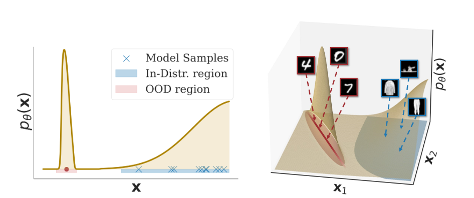
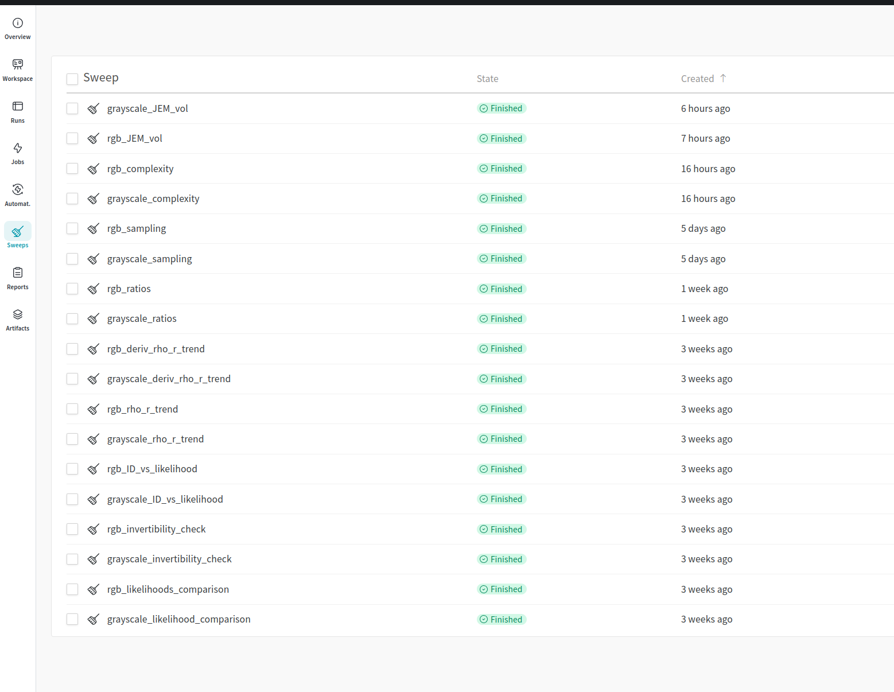

# Explaining the Out-of-Distribution Detection Paradox through Likelihood Peaks 

<p align="center">
  
</p>


# Setting up Datasets and Model Checkpoints

Please create a `.env` file with the following custom content:

```bash
dotenv set MODEL_DIR <root-path-to-model-configurations-and-weights>
dotenv set DATA_DIR <root-path-to-data-directory>
```

Otherwise, the code-base will create a `runs` and `data` directory in the root of the repository.

You can either train our models by running the corresponding sweeps, or you can download our checkpoints provided *here* (anonymized, but will provide link in the review process if needed). The easier option would be the latter because we specifically reference these checkpoints in our OOD detection YAML files.


The file should look like the following after downloading the checkpoints:

```
MODEL_DIR/
|-- checkpoints-443rgkyn/ (grayscale model checkpoints)
|   |-- PiecewiseRationalQuadraticCouplingTransform_mnist_agenizing_xhkxy2eu_final
|   |-- PiecewiseRationalQuadraticCouplingTransform_fashion-mnist_barroom_sax6meoj_final
|   |-- PiecewiseRationalQuadraticCouplingTransform_omniglot_polysynthetic_v816f4eg_final
|   |-- PiecewiseRationalQuadraticCouplingTransform_emnist_papillous_jr5k61wg_final
|   |-- AffineCouplingTransform_mnist_unforgettably_6a8il0rr_final
|   |-- AffineCouplingTransform_fashion-mnist_spritzer_ahbuahyr_final
|   |-- AffineCouplingTransform_omniglot_sarcophaguses_24z9ios4_final
|   |-- AffineCouplingTransform_emnist_josey_zkejz05t_final
|-- checkpoints-zei1ialy/ (rgb model checkpoints)
|   |-- PiecewiseRationalQuadraticCouplingTransform_cifar10_heteronomous_owjcfa1x_final
|   |-- PiecewiseRationalQuadraticCouplingTransform_svhn_hittitics_znujejsh_final
|   |-- PiecewiseRationalQuadraticCouplingTransform_cifar100_unindigenous_42n5ww2b_final
|   |-- PiecewiseRationalQuadraticCouplingTransform_tiny-imagenet_directors_zk9ezaia_final
|   |-- PiecewiseRationalQuadraticCouplingTransform_celeba-small_loculose_8fvoxku1_final
|   |-- AffineCouplingTransform_cifar10_loller_neht0raf_final
|   |-- AffineCouplingTransform_svhn_loricae_8552bnt7_final
|   |-- AffineCouplingTransform_cifar100_dependable_rurkoi3l_final
|   |-- AffineCouplingTransform_tiny-imagenet_mediofrontal_i007b0qb_final
|   |-- AffineCouplingTransform_celeba-small_ricinus_y3xyffia_final
|-- checkpoints-oxtbdajf/ (grayscale background model checkpoints for likelihood ratios)
|   |-- PiecewiseRationalQuadraticCouplingTransform_mnist_immensest_1nffbhhl_final
|   |-- PiecewiseRationalQuadraticCouplingTransform_fashion-mnist_allergia_xfa8aodz_final
|   |-- AffineCouplingTransform_mnist_pistons_bo4c5v4r_final
|   |-- AffineCouplingTransform_fashion-mnist_convolution_crt4sic6_final
|-- checkpoints-ammwz7m2/ (rgb background model checkpoints)
|   |-- PiecewiseRationalQuadraticCouplingTransform_cifar10_comforters_og02pcak_final
|   |-- PiecewiseRationalQuadraticCouplingTransform_svhn_nonperversity_ig1ch4iv_final
|   |-- AffineCouplingTransform_cifar10_masculate_q759dqih_final
|   |-- AffineCouplingTransform_svhn_redemising_dcelecej_final
```

For the data, the code will automatically try to download the corresponding datasets; however, to reproduce using the exact version of all the datasets we have considered, download the zip file *here* (anonymized, but will provide link in the review process if needed) and extract it in your custom data folder:

```
DATA_DIR/
|-- celeba
|-- celeba-small
|-- cifar10
|-- cifar100
|-- emnist
|-- mnist
|-- fashion-mnist
|-- omniglot
|-- svhn
|-- tiny-imagenet
```

To train your own models, please check [RGB models](./meta_configurations/training/colorful_flows.yaml), [Greyscale models](./meta_configurations/training/grayscale_flows.yaml), [RGB Background models](./meta_configurations/training/colorful_background_flows.yaml), and [Greyscale background models](./meta_configurations/training/grayscale_background_flows.yaml).

# Running Single Experiments

To run a single experiment, you can specify a yaml file and either run `train.py` for training models or `main_ood.py` for performing OOD detection tasks:

```bash
python train.py --config configurations/example_ood.yaml # Train an MNIST model
python main_ood.py --config configurations/example_train.yaml # Plot the scatterplot of LID estimates and likelihoods for MNIST on an FMNIST-trained model
```

# Reproducing OOD detection results

To reproduce all of the results we have reported in our paper, please run the following `yaml` files, and when you have obtained the appropriate `<sweep-id>` for each file, you can run the following command:

```bash
./meta_run_ood <sweep-id> <gpu-index> # (optional for parallelism)
```
This will automatically get configurations and run them, storing them in the `final-report` project in your workspace, the final result should look something as follows:



1. Scatterplot comparing LID estimates and Likelihood values for RGB examples ([here](./meta_configurations/ood/rgb_ID_vs_likelihood.yaml)) and Greyscale examples ([here](./meta_configurations/ood/grayscale_ID_vs_likelihood.yaml)).
2. Visualizing all the likelihood pathologies across all the RGB datasets ([here](./meta_configurations/ood/rgb_likelihoods_comparison.yaml)) and Greyscale examples ([here](./meta_configurations/ood/grayscale_ID_vs_likelihood.yaml)).
3. Visualizing the failed sampling experiments on RGB datasets ([here](./meta_configurations/ood/rgb_sampling.yaml)) and Greyscale datasets ([here](./meta_configurations/ood/grayscale_sampling.yaml)).
4. The trend of the approximate likelihood as the radius increases across RGB datasets ([here](./meta_configurations/ood/rgb_rho_r_trend.yaml)) and Greyscale datasets ([here](./meta_configurations/ood/grayscale_rho_r_trend.yaml)).
5. Scatteplot comparing the Complexity scores from [(Serra et al.)](https://openreview.net/forum?id=SyxIWpVYvr) with likelihoods on RGB datasets ([here](./meta_configurations/ood/rgb_complexity.yaml)) and Greyscale datasets ([here](./meta_configurations/ood/grayscale_complexity.yaml)).
6. Scatterplot comparing the Likelihood ratios from [(Ren et al.)](https://proceedings.neurips.cc/paper/2019/file/1e79596878b2320cac26dd792a6c51c9-Paper.pdf) with likelihoods on RGB datasets ([here](./meta_configurations/ood/rgb_ratios.yaml)) and Greyscale datasets ([here](./meta_configurations/ood/grayscale_ratios.yaml)).
7. Scatterplot comparing the derivative norm of the likelihoods and likelihood values for RGB datasets ([here](./meta_configurations/ood/rgb_JEM_vol.yaml)) and Greyscale datasets ([here](./meta_configurations/ood/grayscale_JEM_vol.yaml)).